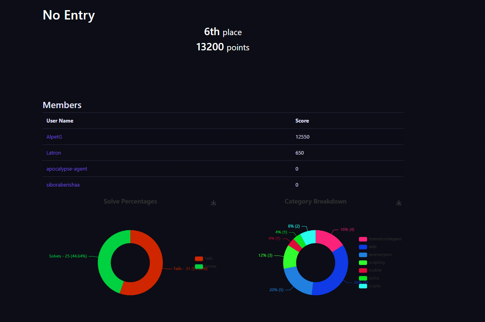
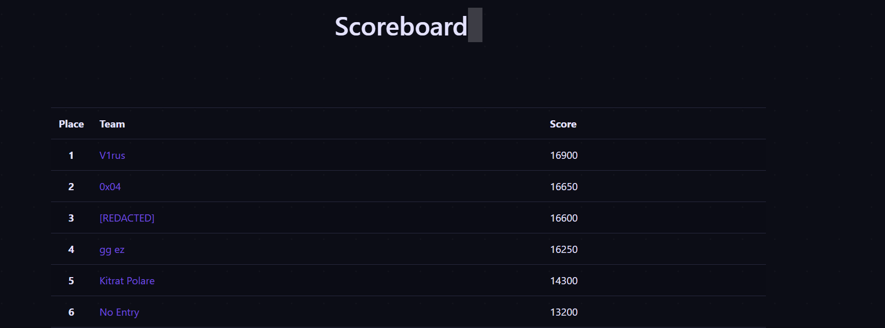

# CTF Cyber Security Challenge - Kosovo & Albania 2026 Final

> This Challage are not offical write up this are my challage i solve in my way

## Web

- [Silent Operator](web/Silent%20Operator) (300)
- [Cloud Storage](web/Cloud%20Storage) (400)
- [Corrupt Middleware](web/Corrupt%20Middleware) (400)
- [Corporate Intranet](web/Corporate%20Intranet) (400)
- [Serial Killer](web/Serial%20Killer) (400)
- [Search & Destroy](web/Search%20&%20Destroy) (500)
- [Forgotten Archive](web/Forgotten%20Archive) (600)
- [Under Construction](web/Under%20Construction) (650)
- [MediCare](web/MediCare) (650)
- [Poisonous](web/Poisonous) (650)
- [JobSeeker](web/JobSeeker) (1000)
- [Awaiting Administrator](web/Awaiting%20Administrator) (1000)
- [Prototype Board](web/Prototype%20Board) (1000)
- [Digital Footprint](web/Digital%20Footprint) (1200)

## Scripting

- [Dynamic Data Service](scripting/Dynamic%20Data%20Service) (400)
- [Mind Palace](scripting/Mind%20Palace) (600)
- [RSA Timming Attack](scripting/RSA%20Timming%20Attack) (800)

## OT-ICS

- [read_plc](ot-ics/read_plc) (200)
- [dam_Logic_overflow](ot-ics/dam_Logic_overflow) (300)
- [Industrial Espionage](ot-ics/Industrial%20Espionage) (400)
- [save_your_friends](ot-ics/save_your_friends) (700)

## Reverse-PWN

- [PYC](reverse-pwn/PYC) (250)
- [Encryption Breaker](reverse-pwn/Encryption%20Breake) (350)
- [Stack Attack](reverse-pwn/StachAttack) (500)
- [Assembly Line Debugger](reverse-pwn/Assembly%20Line%20Debugger) (500)
- [Stack Attack v2](reverse-pwn/Stack%20Attack%20v2) (700)

## Forensics-Stegano

- [Rasputin](forensics-stegano/Rasputin) (100)
- [Fluffy](forensics-stegano/Fluffy) (250)
- [ACME Vault](forensics-stegano/ACME%20Vault) (300)
- [Echoes](forensics-stegano/Echoes) (350)
- [Cridex](forensics-stegano/Cridex) (400)

## Mobile

- [SecureVault](mobile/SecureVault) (400)
- [SecureChat](mobile/SecureChat) (400)

## Crypto

- [Data Corruption](crypto/Data%20Corruption) (250)
- [Pandora Box](crypto/Pandora%20Box) (300)"

